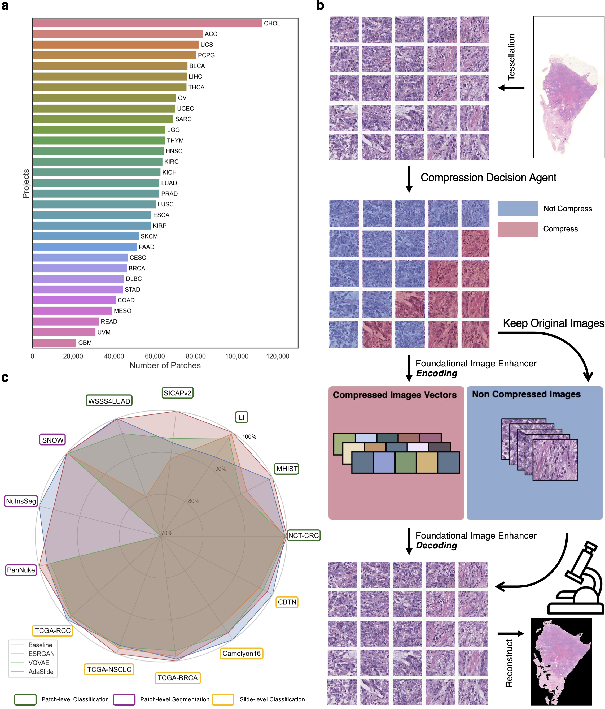
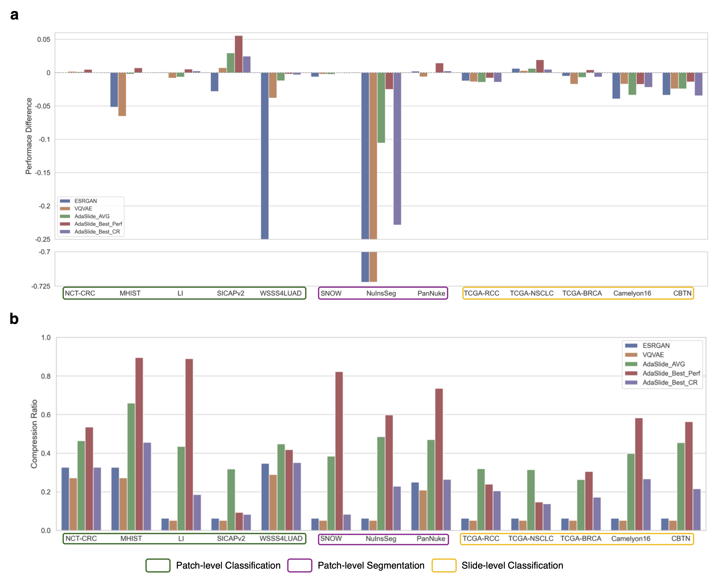

# AdaSlide 
Adaptive Compression Framework for Giga-pixel Whole Slide Images

## Abstract
Digital pathology images require significant storage space, leading to high costs. To address this, compressing pathology images for storage and restoration has been proposed; however, this involves a trade-off between compression ratio and information loss. Traditional compression techniques often apply a uniform compression ratio, ignoring the variable informational content across different slide regions (information disequilibrium). \textbf{AdaSlide}, an **Ada**ptive compression framework for giga-pixel whole **Slide** images, overcomes this limitation by integrating a compression decision agent (CDA) and a foundational image enhancer (FIE), enabling adaptive compression decisions aware of information disequilibrium. The CDA uses reinforcement learning to assess each patch's necessity and degree of compression, ensuring minimal information loss and maintaining diagnostic integrity. The FIE, trained on diverse cancer types and magnifications, guarantees high-quality post-compression image restoration.

The FIE's performance was evaluated using a visual Turing test, where pathology experts could barely distinguish between real images and compressed-restored images (55\% accuracy, coincidence level: 50\%). In 12 downstream tasks (including patch-level classification, segmentation, and slide-level classification), AdaSlide maintained the prediction performance of the original images in 8 out of 12 tasks. In contrast, traditional methods with a uniform compression ratio only maintained performance in 3 out of 12 tasks, raising concerns about information loss. Additionally, AdaSlide could store data using less than 10\% of the original WSI size. This indicates that, unlike traditional methods, AdaSlide can efficiently compress data while preserving clinically significant information. Furthermore, AdaSlide provides flexibility with its study objective-oriented reward function, compression tendency, and FIE backbone architectures. This adaptive approach ensures efficient storage and retrieval, potentially transforming the management of digital pathology data storage systems by aligning compression strategies with clinical relevance, thereby facilitating both cost reduction and improved diagnostic processes.

## Performances
AdaSlide was evaluated on various tasks: patch-level classification, path-level segmentation, and slide-level classifications. AdaSlide maintained the prediction performance of the original images in 8 out of 12 tasks. In contrast, traditional methods with a uniform compression ratio (ESRGNA, VQVAE) only maintained performance in 3 out of 12 tasks, raising concerns about information loss.

## How to install?
I recommend using Anaconda or Miniconda. The Python version is 3.8. 

1. Type command: `sudo apt -y install openslide-tools`
2. Type command: `pip install -r requirements.txt`
3. Type command: `cd CLAM/smooth-topk; python setup.py install; cd ../..`

## How to train new AdaSlide models?
Please read and follow the instructions [step_by_step_instruction](docs/step_by_step_guide.md.md)